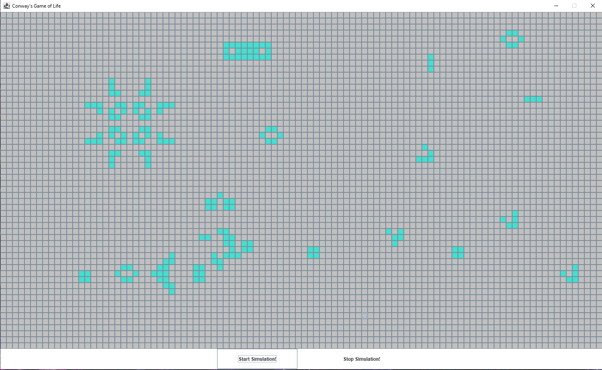

Visualization of John Conway's Game of Life
Each cell has an initial state: live (represented by a 1) or dead (represented by a 0).  
Each cell interacts with its eight neighbors (horizontal, vertical, diagonal) using the following four rules (taken from the Wikipedia article <a href="https://en.wikipedia.org/wiki/Conway%27s_Game_of_Life"> Game of Life </a>):
 
           1. Any live cell with fewer than two live neighbors dies as if caused by under-population.  
           2. Any live cell with two or three live neighbors lives on to the next generation.  
           3. Any live cell with more than three live neighbors dies, as if by over-population.  
           4. Any dead cell with exactly three live neighbors becomes a live cell, as if by reproduction.  
The next state is created by applying the above algorithms simultaneously to every cell in the current state, where births and deaths occur simultaneously.

